# AWS ALB + Auto Scaling + CloudWatch + SNS

## Project Overview

This project documents a scalable AWS web application using an Application Load Balancer (ALB), an EC2 Auto Scaling Group (ASG), Amazon CloudWatch monitoring, and Amazon SNS email notifications.

## Architecture

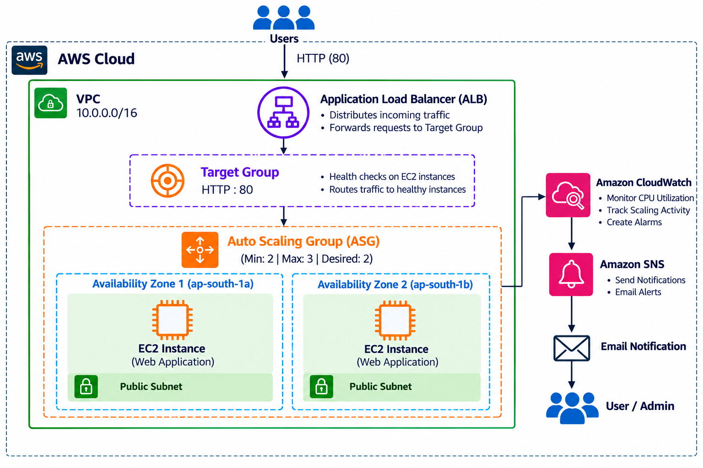

### Traffic Flow

```text
Users
  |
  v
Application Load Balancer
  |
  v
Target Group
  |
  v
Healthy EC2 web servers managed by ASG
```

### Monitoring and Notification Flow

```text
EC2 / ASG metrics
       |
       v
   CloudWatch
       |
       v
  CloudWatch Alarm
       |
       v
  SNS Topic (if linked to the alarm)
       |
       v
  Email Subscriber
```

## AWS Services Used

| Service | Purpose |
|---|---|
| EC2 | Runs the web application |
| Application Load Balancer | Routes traffic to healthy instances |
| Target Group | Registers targets and checks health |
| Launch Template | Defines new EC2 instance settings |
| Auto Scaling Group | Manages EC2 capacity |
| CloudWatch | Provides metrics and alarms |
| SNS | Sends email notifications |
| VPC | Provides AWS networking |

## Auto Scaling Configuration

| Setting | Value |
|---|---|
| Auto Scaling Group | ASG-1 |
| Minimum capacity | 2 |
| Desired capacity | 2 |
| Maximum capacity | 3 |
| Scaling policy | Target Tracking |
| Target average CPU utilization | 50% |

The scaling policy adjusts capacity based on CPU utilization, within the configured minimum and maximum limits.

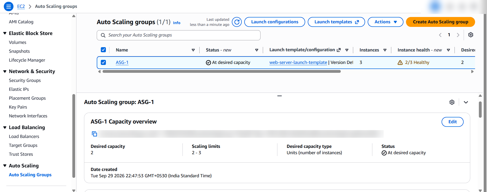

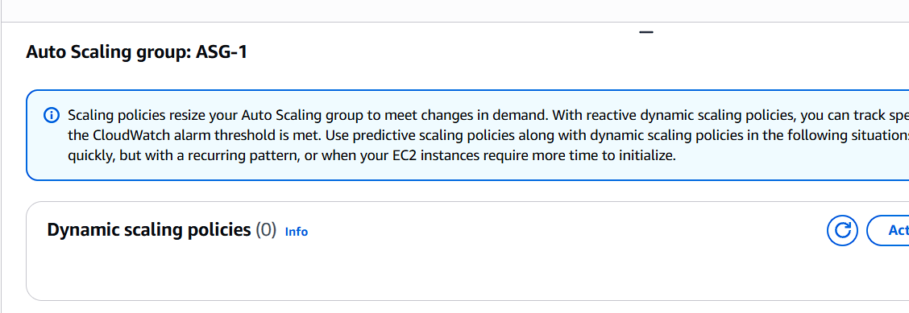

## Implementation and Screenshots

### 1. EC2 Instances

EC2 instances host the web application.

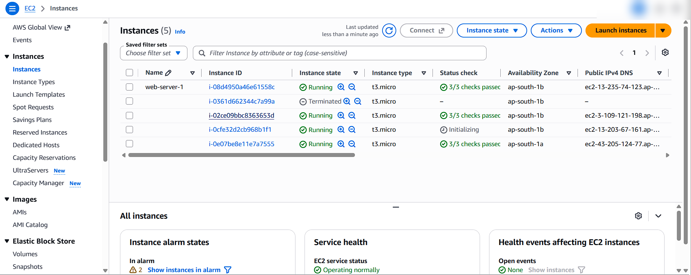

### 2. Target Group

The target group checks instance health and supplies targets for the ALB.

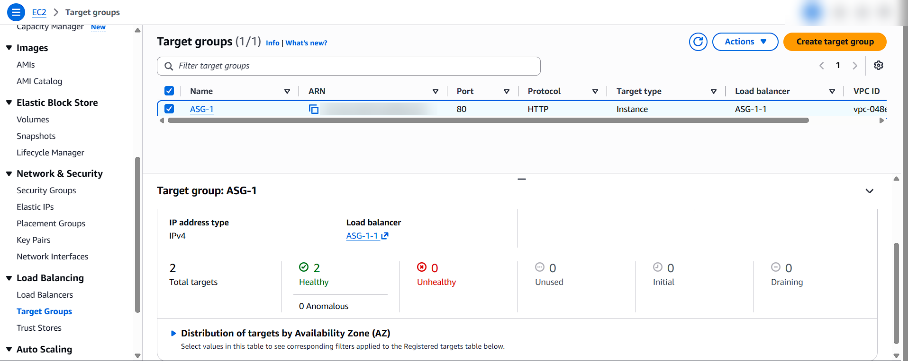

### 3. Application Load Balancer

The ALB distributes incoming requests across healthy targets.

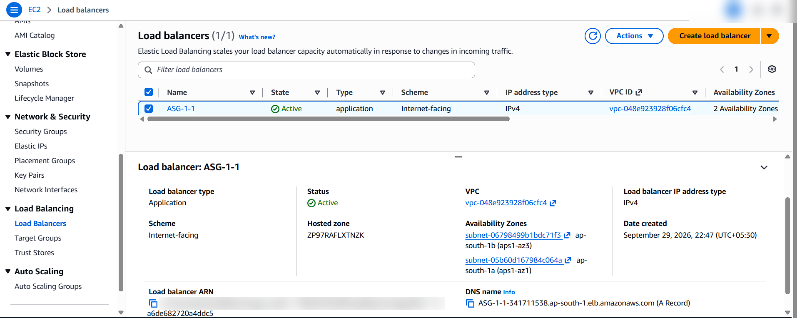

### 4. CloudWatch Monitoring

CloudWatch displays CPU utilization and scaling-related alarms.

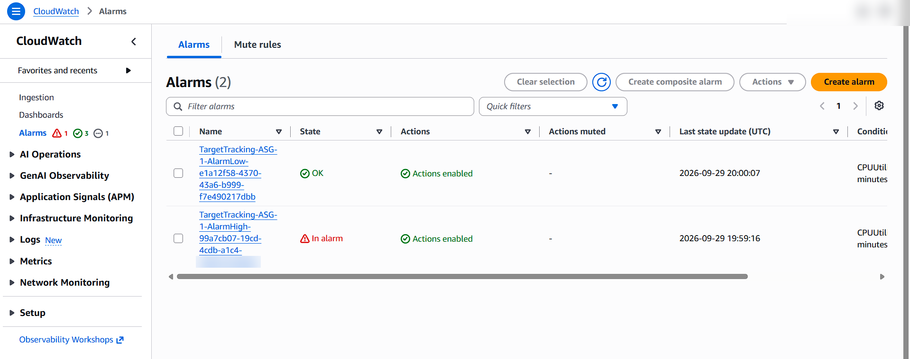

### 5. SNS Notifications

An SNS topic and email subscription provide notifications. Email subscriptions must be confirmed to receive messages.

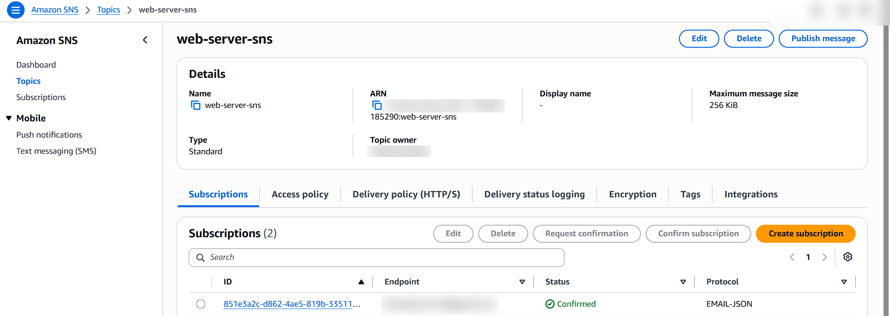

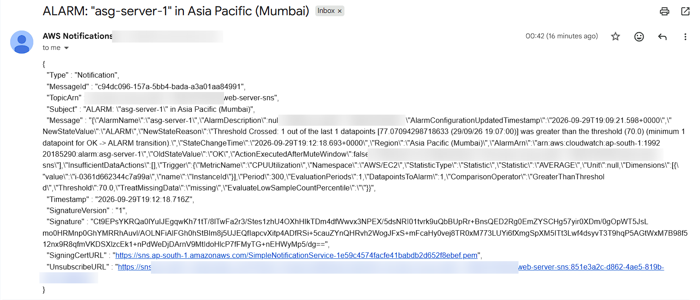

## Auto Scaling Demonstration

The ASG is configured for a minimum of **2** and a maximum of **3** instances. The screenshot below records the scaling result.

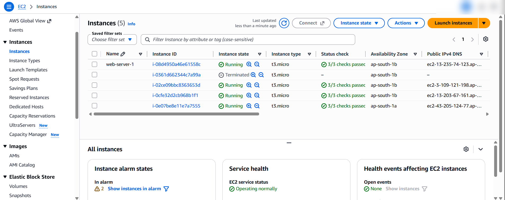

## Application Verification

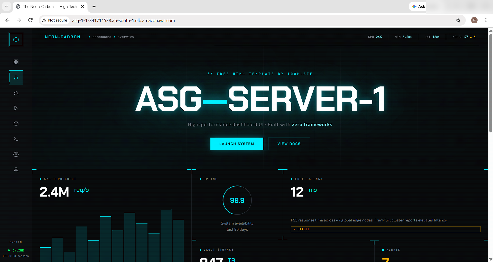

## Detailed Documentation

- [Auto Scaling configuration](aws-config/auto-scaling.md)
- [Load Balancer configuration](aws-config/load-balancer.md)
- [CloudWatch configuration](aws-config/cloudwatch.md)
- [SNS configuration](aws-config/sns.md)
- [Troubleshooting and lessons learned](troubleshooting/common-issues.md)

## Project Structure

```text
aws-alb-auto-scaling-sns-project/
├── README.md
├── architecture/
│   └── architecture.png
├── aws-config/
│   ├── auto-scaling.md
│   ├── cloudwatch.md
│   ├── load-balancer.md
│   └── sns.md
├── screenshots/
│   ├── 03-target-group.png
│   ├── 04-application-load-balancer.png
│   ├── 05-auto-scaling-group.png
│   ├── 06-target-tracking-policy.png
│   ├── 07-cloudwatch-alarms.png
│   ├── 08-sns-topic.png
│   ├── 09-sns-email-notification.png
│   ├── 10-ec2-instances.png
│   ├── 11-auto-scaling-result.png
│   └── 12-application-dashboard.png
└── troubleshooting/
    └── common-issues.md
```

## Skills Demonstrated

EC2, load balancing, target groups, health checks, Auto Scaling, CloudWatch monitoring, SNS notifications, and AWS infrastructure troubleshooting.

## Author

**Piyush Keshri** — DevOps Aspirant
